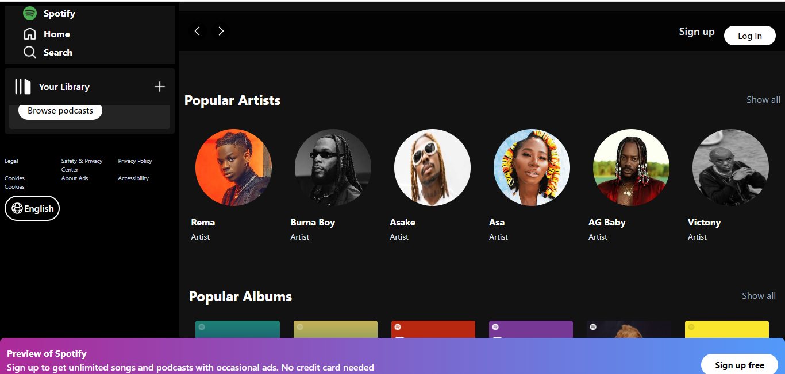
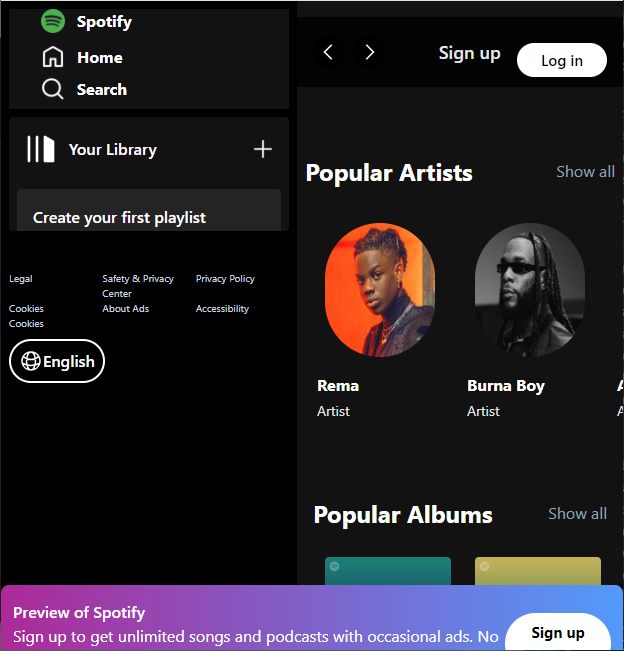

# Shopify Landing Page Clone

## Overview

This project is part of the Codevixens 10 Days of Frontend Challenge (Day 5). This clone of the Spotify Landing Page was built using Vite React and styled with TailwindCSS. The task focuses on mastering  layout, styling, and responsiveness in ReactJS.

## Features

- **CSS Styling:** TailwindCSS was used by adding class names to JSX elements and generating corresponding styles.
- **Responsive Design:** Built with Mobile-first responsive design

## Installation

1. Clone the repository: ```javascript git clone https://github.com/Nkwor-Jane/spotify_clone.git```

2. Navigate to the project directory: ```javascript cd spotify_clone```

3. Install dependencies:```javascript npm install```

## Usage

1. Start the development server: ```javascript npm run dev```

2. Open your browser and navigate to: ```javascript http://localhost:5173/```

## Screenshots

- Desktop View
  


- Mobile View


## Live Demo

Check out the live demo [here](https://shopify-clone-beta-lemon.vercel.app/).

## Contirbuting

Feel free to clone and fork this repository. You can also submit pull requests. Any contributions are welcome!

## License

This project is licensed under the MIT License

## Acknowledgements

- [Codevixens](https://codevixens.org/) for organizing this challenge.
- Lois Bassey, Chinaza Igboanugo, Gaelle Tiku Brenda - and Oyakinsola Shoroye for their contributions and guidance towards the successful completion of this projects.

Feel free to customize it further to fit your needs! If you have any specific details you'd like to add or change, let me know.
